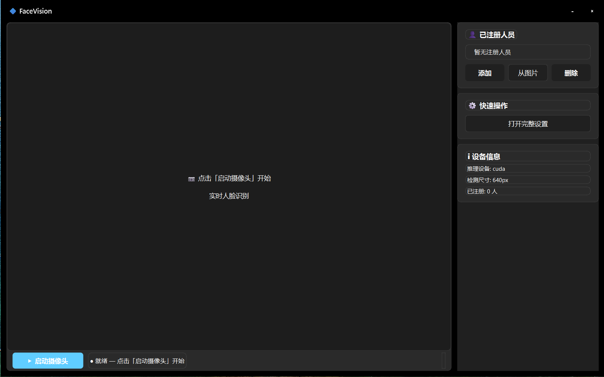
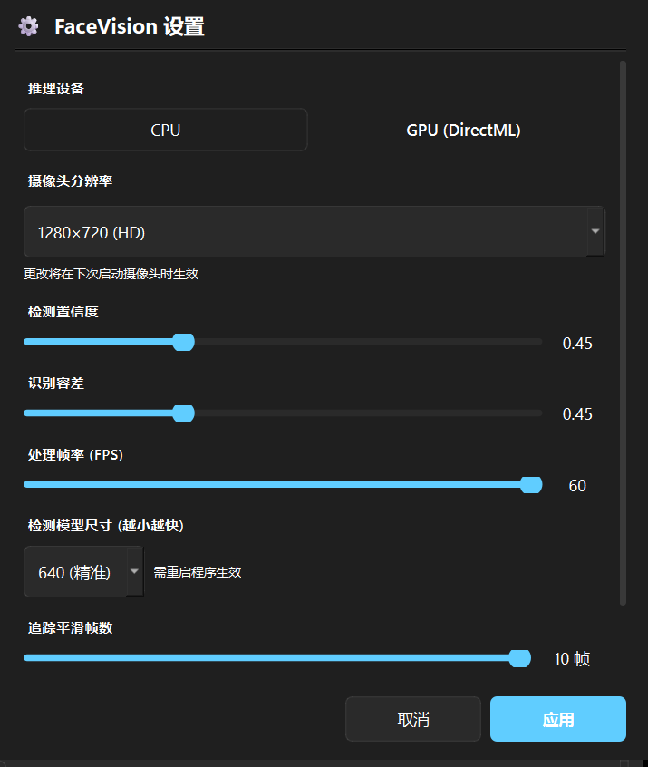

# FaceVision — Real-Time Face Recognition System

<p align="center">
  <strong>English</strong> | <a href="README.zh-CN.md">简体中文</a> | <a href="README.zh-TW.md">繁體中文</a>
</p>

<p align="center">
  
  
  
  
  
  
  
</p>

> A Windows real-time face recognition system powered by `insightface` and `PyQt6`, featuring a dark Windows 11 Mica glassmorphism UI with DirectML GPU acceleration.

<p align="center">
  
</p>

---

## 📋 Table of Contents

- [Features](#-features)
- [Tech Stack](#-tech-stack)
- [Requirements](#-requirements)
- [Installation](#-installation)
- [Quick Start](#-quick-start)
- [How It Works](#-how-it-works)
- [Configuration](#-configuration)
- [Project Structure](#-project-structure)
- [FAQ](#-faq)

---

## ✨ Features

- Real-time camera face detection and recognition
- `insightface` `buffalo_l` model (RetinaFace + ArcFace)
- 512-d normalized feature vectors + cosine similarity 1:N matching
- **Temporal Tracking** — IoU multi-object tracking + sliding-window identity voting to eliminate flicker
- **Quality Filtering** — blur detection + minimum face size filtering
- DirectML GPU acceleration with automatic CPU fallback
- Multi-frame registration (15 frames + sharpness ranking + median fusion)
- Local image import with target face selection for registration
- **PyQt6 Dark Dashboard UI** — Windows 11 Mica backdrop · pure dark palette · global white typography
- **Frameless Window** — custom title bar with drag · minimize/close buttons
- **Scrollable Settings Panel** — 10 adjustable parameters with instant effect
- Fully decoupled UI and ML inference threads for smooth performance

---

## 🛠 Tech Stack

| Component | Technology |
|-----------|------------|
| **Language** | Python 3.9+ |
| **GUI Framework** | PyQt6 + Windows 11 Mica |
| **Face Detection** | InsightFace RetinaFace |
| **Feature Extraction** | ArcFace (512-d embeddings) |
| **Similarity** | Cosine Similarity (1:N) |
| **Temporal Tracking** | IoU + Sliding-Window Voting |
| **Inference Backend** | ONNX Runtime (DirectML / CPU) |
| **Image Processing** | OpenCV, Pillow |
| **Numerical Compute** | NumPy |

---

## 💻 Requirements

- Windows 10 / Windows 11
- Python 3.9 or later
- USB or built-in webcam

---

## 📦 Installation

```bash
git clone https://github.com/allen902/FaceVision.git
cd facevision_py
python -m venv venv
.\venv\Scripts\activate
pip install -r requirements.txt
```

### Optional: Install DirectML GPU Support

```bash
pip uninstall onnxruntime onnxruntime-directml -y
pip install onnxruntime-directml==1.24.0
```

---

## 🚀 Quick Start

```bash
python main.py
```

1. Click **Start Camera**
2. Click **Add Person**, enter a name, and face the camera to register
3. Or click **From Image** to register a face from a local photo
4. When a registered person appears, their name and confidence score are shown on screen

---

## 🔧 How It Works

### Face Detection

- `face_detector.py` uses `insightface.app.FaceAnalysis(name='buffalo_l')`
- A single inference pass yields bounding boxes + confidence scores + 512-d feature vectors
- Filtered by `confidence` threshold + `quality_filter` (blur check) + `min_face_size`

### Face Recognition

- `face_recognizer.py` performs cosine similarity 1:N matching
- Built-in encoding cache with versioning to avoid redundant rebuilds

### Temporal Tracking

- `face_tracker.py` uses IoU matching + sliding-window identity voting
- Identity is confirmed only when majority voting holds over `track_smooth` frames, eliminating flicker

### Person Registration

- Live registration: 15-frame capture → sharpness ranking → median fusion of the top 2/3
- Image import: supports local photo registration with click-to-select for multiple faces
- Data storage: `face_db.json` + `encodings.pkl` + `face_photos/`

### Settings (10 Parameters)

| Setting | Type | Range | Description |
|---------|------|-------|-------------|
| Inference Device | Toggle | CPU / GPU | Auto-detect DirectML / CUDA |
| Camera Resolution | Dropdown | 8 options | 320×240 ~ 1280×720 |
| Detection Confidence | Slider | 0.30 ~ 0.80 | RetinaFace detection threshold |
| Recognition Tolerance | Slider | 0.30 ~ 0.80 | Cosine similarity threshold |
| Processing FPS | Slider | 5 ~ 60 | ML inference frame rate cap |
| Detection Model Size | Dropdown | 320 / 480 / 640 | Smaller = faster |
| Tracking Smooth Frames | Slider | 3 ~ 10 | Consecutive frames needed to confirm identity |
| Quality Filter | Checkbox | On / Off | Blur detection |
| Min Face Size | Dropdown | 60 / 80 / 100 / 120 px | Faces smaller than this are ignored |

<p align="center">
  
</p>

---

## ⚙ Configuration

`settings.json` is auto-generated by the application:

```json
{
  "device": "cuda",
  "confidence": 0.50,
  "tolerance": 0.45,
  "cam_width": 640,
  "cam_height": 360,
  "cam_fps": 30,
  "proc_fps": 30,
  "det_size": 640,
  "track_smooth": 5,
  "min_face_size": 60,
  "quality_filter": true
}
```

Runtime-generated files:

- `face_db.json` — registered person records
- `encodings.pkl` — face feature vectors
- `face_photos/` — registration face snapshots

---

## 📁 Project Structure

```text
facevision_py/
├── main.py                # Application entry point
├── config.py              # Configuration manager (settings.json)
├── camera.py              # Camera capture thread
├── face_detector.py       # Face detection + feature extraction
├── face_recognizer.py     # Face recognition (cosine similarity)
├── face_database.py       # Data persistence (JSON + pickle)
├── face_tracker.py        # Temporal tracking (IoU + voting)
├── ui_pyqt6.py            # ★ PyQt6 dark UI (current main interface)
├── ui_pyqt.py             # Legacy PyQt5 UI (kept for reference)
├── requirements.txt       # Python dependencies
├── CLAUDE.md              # AI Agent context guide
├── README.md              # Project documentation
├── settings.json          # Runtime config (auto-generated)
├── face_db.json           # Person database (auto-generated)
├── encodings.pkl          # Feature vectors (auto-generated)
└── face_photos/           # Registration photos (auto-generated)
```

---

## ❓ FAQ

- **No camera detected** — Ensure your webcam is connected and allowed in privacy settings
- **GPU toggle unavailable** — Install `onnxruntime-directml` or fall back to CPU
- **Registration fails** — Face the camera squarely, stay still, and avoid occlusion or rapid movement
- **Recognized as "Unknown"** — Lower the `tolerance` value or re-register with clearer samples
- **Dropdown appears blank** — Fixed; QComboBox popup lists require independent QSS styling

---

## 🙏 Acknowledgments

- Special thanks to **Leon Jane** for providing facial support during functional testing of this application.

---

## 📄 License

MIT License — see the [LICENSE](LICENSE) file for details.

Copyright (c) 2026 [Allen](https://github.com/allen902)
